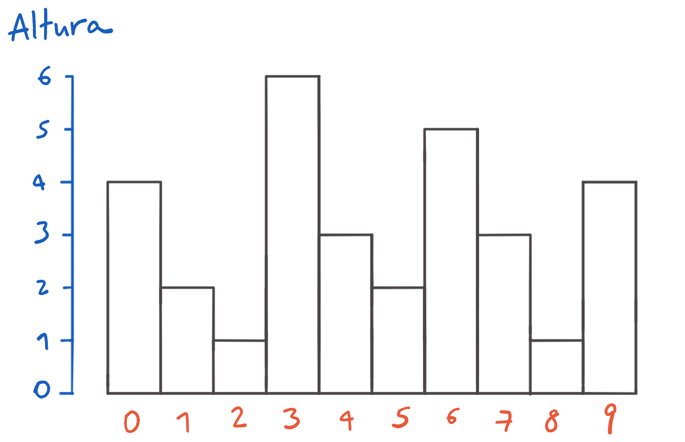
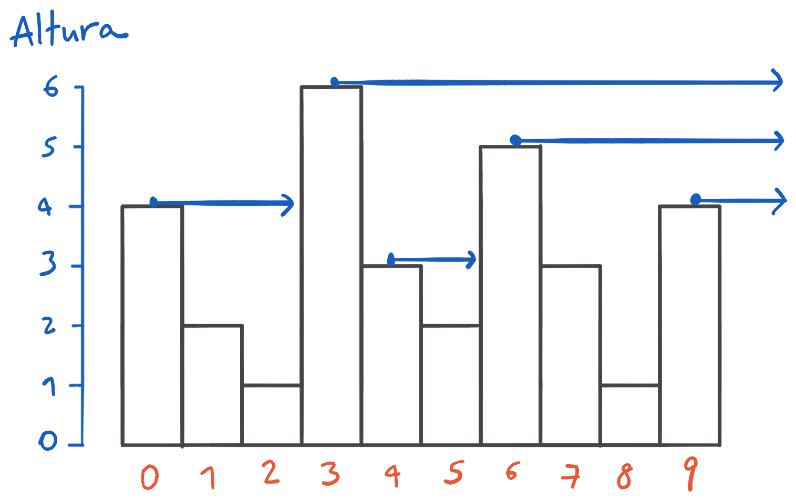

    

    

      <h1>0xcf - Mirando al horizonte</h1>
      

        
En una calle hay <code>N</code> edificios de varias alturas numerados de <code>0</code> a <code>N-1</code> de izquierda a derecha:

Una persona se sube al techo de cada edificio y mira en una línea recta paralela al suelo en la dirección en la que aumentan los números de los edificios (hacia la derecha en el diagrama). A veces, la persona logra ver el horizonte en la distancia, pero a veces no porque un edificio más alto bloquea la vista.

Por ejemplo, desde el edificio <code>0</code> (que tiene altura 4) no se ve el horizonte porque el edificio <code>3</code> (que tiene altura 6) bloquea la vista. Similarmente, desde el edificio <code>4</code> tampoco se ve el horizonte porque el edificio <code>6</code> bloquea la vista. Desde los edificios <code>3</code>, <code>6</code> y <code>9</code>, en cambio, sí se puede ver el horizonte en la distancia porque ningún otro edificio bloquea la vista:

Escribe un programa que calcula, para cada edificio, si es posible ver el horizonte o no. Si no es posible, tu programa debe determinar la <strong>altura</strong> del edificio que está bloqueando la vista.

<h2>Entrada</h2>

El archivo de entrada contiene varios casos de prueba. En la primera línea hay un número <code>C</code>, el número de casos.

Luego siguen <code>C</code> casos, cada uno compuesto de 2 líneas:

<ul>
<li>La primera línea tiene <code>N</code>, el número de edificios.</li>
<li>La segunda línea tiene <code>N</code> números enteros: la altura <code>ai</code> del edificio <code>i</code> para todo 0 ≤ <code>i</code> &lt; <code>N</code>. Está garantizado que <code>ai</code> satisface 0 ≤ <code>ai</code> ≤ 109.</li>
</ul>
<h2>Salida</h2>

Para cada caso, la salida debe tener una línea en el formato <code>Case #x: v0 v1 ... vn-1</code>,  donde <code>x</code> es el número de caso (empezando en 1) y <code>vi</code> es la altura del edificio que bloquea la vista al mirar al horizonte desde el techo del edificio <code>i</code>, ó <code>-1</code> si ningún edificio bloquea la vista.

<h2>Entrada de ejemplo</h2>
<pre><code>3
10
4 2 1 6 3 2 5 3 1 4
3
1 1 2
6
3 3 2 2 1 1
</code></pre>
<h2>Salida de ejemplo</h2>
<pre><code>Case #1: 6 6 6 -1 5 5 -1 4 4 -1
Case #2: 2 2 -1
Case #3: -1 -1 -1 -1 -1 -1
</code></pre>
<h3>Restricciones</h3>

Está garantizado que:

<ul>
<li>En 50% de los casos, <code>1 &lt;= N &lt;= 100</code>.</li>
<li>En el otro 50% de los casos, <code>1 &lt;= N &lt;= 500000</code>.</li>
</ul>
<!--

## Probando Matemáticas

When @@\sqrt{a} < 0@@ there are two solutions to @@ax^2 + bx + c = 0@@ and they are
$$x = {-b \pm \sqrt{b^2-4ac} \over 2a}.$$

$$ f(a) = \frac{1}{2\pi i} \oint\frac{f(z)}{z-a}dz $$

@@\sigma = \sqrt{ \frac{1}{N} \sum\_{i=1}^N (x_i -\mu)^2}@@

$$ \sigma = \sqrt{ \frac{1}{N} \sum\_{i=1}^N (x_i -\mu)^2} $$

-->

      

      

        <h2>Envía tu solución</h2>
        <form class="new_submission" id="new_submission" action="https://codeo.app/problemas/0xcf-mirando-al-horizonte/envios" accept-charset="UTF-8" method="post" data-np-checked="1"><input type="hidden" name="authenticity_token" value="vhZqDhz3hLfEaA/jxWE3sV+8v6NlG4WA1QOOkAh30Z2zmVgl9zb/fiQM52IjmcUVsGUZpBmly/PM5U5jf+PA/Q==" data-np-checked="1">

  

    <label for="submission_language">Lenguaje</label>
    <select name="submission[language]" id="submission_language"><option value="C">C</option>
<option value="C++">C++</option>
<option value="Go">Go</option>
<option value="Java">Java</option>
<option value="JavaScript">JavaScript</option>
<option value="Python 3">Python 3</option>
<option value="Ruby">Ruby</option>
<option value="C#">C#</option></select>
  

  

    <label for="submission_source_code">Código fuente</label>
    <textarea class="form-control form-control-lg" rows="12" disabled="disabled" name="submission[source_code]" id="submission_source_code"></textarea>
  

    <input type="submit" name="commit" value="Enviar solución" class="btn btn-primary" disabled="disabled" data-disable-with="Enviar solución">
    <small>Necesitas <a href="https://codeo.app/usuarios/login">iniciar sesión</a> para enviar una solución.</small>
</form>
      

    

    

  

